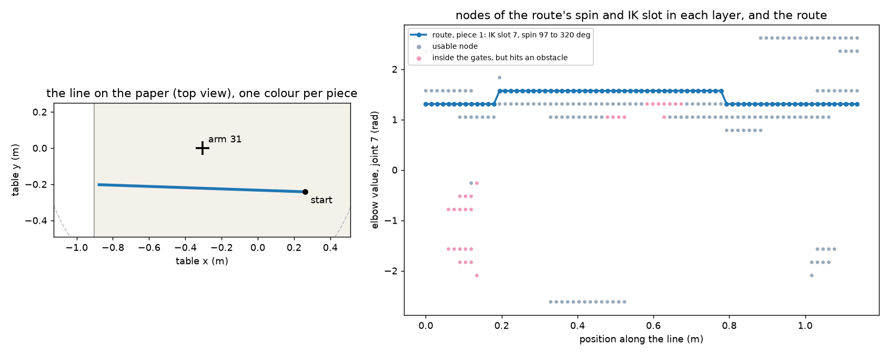

# local — the local planner

**Job.** Given lines on the paper, find how one arm holds and moves the pen to draw each of them.
Same code for every arm, everything in the arm's base frame. It knows nothing about the table,
the canvas or the other arms: obstacles arrive as geometry, and the paper is the plane of kind
"paper" among them.

Files: `aris/local/` — `planner.py` (the one call), `lattice.py` (the graph), `search.py` (the
sweep), `backout.py` (the exact path and its check), `pieces.py` (pieces, leftovers,
alternatives), `gates.py` (what a configuration must pass), `table.py` (the kinematic table),
`polyline.py`, `settings.py`.

## In and out

`plan(arm, lines, obstacles, rules, gates, workers=1, cache_dir=None) -> (bunches, leftovers)`

- **In:** lines (pen-tip polylines in the base frame), the obstacles, the drawing rules (draw
  speed, largest lean, shortest piece), the gates (joint-limit distance, singular value,
  clearance to itself).
- **Out:** one `Bunch` per piece. A line drawn in one go is one piece; a line where the arm has
  to lift and change shape is several. A bunch holds up to four alternative plans that start
  or end in a really different arm shape; the sequencer picks one. Each plan is a joint path
  with the pen on the line, its arc length, the pen tip, the spin and lean, a score (the
  clearance of the flown path, metres), the joint travel and the draw time. Each plan can be
  run in either direction (`reverse_plan`).
- And a `Leftover` for every stretch not drawn: `unreachable` (no arm configuration inside the
  gates, or no continuous motion), `blocked` (there are configurations, but the obstacles remove
  them all; the detail names the obstacle), `too_short` (under `rules.min_piece`).
- Nothing is dropped: for every line, pieces and leftovers cover it exactly once.
- `plan_detailed` returns the same plus what each line cost; `verify_plan` checks a plan from
  outside.

## The graph

One **layer** every 1.5 cm along the line. A **node** is one choice of

- spin: the hand turned about the paper normal, counted from the direction pointing away from
  the base axis, 24 values (15 degrees apart, a circle);
- lean: the pen tilted off its nominal direction, a 2-vector; zero, or 12 more up to
  `rules.lean_max` (two rings of six);
- elbow value: joint 7, which the IK takes as given, 21 values 15 degrees apart;
- IK slot: which of the solver's up to 8 answers (the slot is the branch).

With the tip on the line that is one joint configuration (`arm.hand_pose`, then `arm.ik`).
A node is **usable** when it passes the gates. Cheap tests first: joint limits and singular
value on all answers; then the arm against the paper and against itself; the other obstacles
last, only on what survived. Against the paper the pen is free, the tool (holder, blades, hand)
keeps the paper's `tool_margin` and the links its 20 mm (the kernel's rule).

**The kinematic table** (with `cache_dir`). The arm is symmetric about its base axis: turning
the tip about the axis only adds that angle to joint 1. So for a paper square to the axis the
nodes depend only on the tip's distance from the axis, the spin counted from the outward
direction, lean, elbow value and slot, and are tabulated once (every 1 cm of distance) with
their singular value, limit margins and clearances to the paper and to the arm itself. A node
is then a lookup, blended between the two tabulated distances; joint 1's limit and the
obstacles stay live. The table only guides: the exact path below is solved and verified as
always. Without `cache_dir` the nodes are solved with the IK.

**Edges** go from one layer to the next only, between neighbours (same slot; same or next
absolute spin, elbow value and lean; spin wraps round), and only when no joint moves more than 0.35 rad. That
cap keeps the arm on one branch while the pen is down. Spins and elbow values are spaced alike on
purpose: at zero lean both turn about the paper normal, so a step of both together is a small
move, and the diagonal edges are the cheap ones.

**Lift edges** stay at one point of the line and join any node to any other, at a fixed cost of
5 rad of joint motion. A line drawn in one go uses none; each lift edge on the chosen route is a
cut between two pieces. A step that cannot be drawn at all is left undrawn at a cost far above
anything else (1000 per step), which is how a leftover enters the search.

## The objective and the search

Stay on usable nodes (yes or no per node) and minimise the joint motion summed along the route
plus the lift costs. The search is one sweep over the layers (dynamic programming): for each
layer, the cheapest way to reach every node, from the previous layer along an edge, by a lift,
or by putting the pen down after an undrawn stretch. Array operations over whole layers.

**Narrow first.** The first graph has zero lean only. Where its route lifts or leaves a gap, the
layers within 6 cm are opened to every lean and the sweep runs again (at most three rounds).

## The exact path

Along the route, spin, lean and elbow value are read off a smooth curve through the route's
nodes (averaged over about two layers, so the grid's staircase becomes the drift it stands for),
and the IK is solved again every 2 mm, and at every corner of the line, in the route's slot.
Joint angles are never interpolated. Where the straight joint move between two samples would
take the pen more than 0.02 mm off the line, a sample is added halfway.

Then the path is checked from its joint samples alone: the tip on the line (1e-6 m) and near
it between samples; every gate at every sample; no joint moving more than 0.1 rad between
samples; the arm clear of itself; and the clearance along the whole path, motion between
samples included (`path_clearance`). If the smooth curve fails, the curve through every node is
tried; if that fails too, the nodes at the failure are banned and the sweep runs again. An
unverified plan is never returned.

**Piece ends.** Next to an undrawn stretch the route stops at a layer, but the arm can usually
go a little further. The exact solve walks on past the end layer (and back before the first,
never into a neighbouring piece), holding the end's spin, lean and elbow value, until a gate or
the clearance stops it; the longer piece is kept if its whole path verifies. So a piece ends
where the arm really has to stop, not up to a layer (1.5 cm) short of it.

## The alternatives

For each piece, one more sweep over its layers with no lifts gives, for every node of its last
layer, the best route there and where it started. Routes are grouped into families by IK slot
and the quarter-turn of the spin at each end; the best of each family, cheapest first, is
solved exactly and checked; a family whose start and end are both within 0.5 rad (every joint)
of a plan already taken is skipped. At most four. Each plan is timed with `kernel.retime`
(corner to corner: the pen stops at a sharp corner anyway); a plan that cannot be timed, or
whose flown path could come closer than allowed (the timing step keeps it within 0.15 mrad of
the path, which is charged against the clearance), is not returned.

## Figure

## What it cannot do

- Timing is corner to corner (the pen stops at every corner sharper than 30 degrees); to be
  replaced by one call now that the timing step is fast.
- The graph is rebuilt for every line; nothing is shared between lines. Checking every
  surviving node against the obstacles is most of the time (see below).
- The kinematic table assumes the paper square to the base axis; on a tilted (calibrated)
  paper it still guides, and the exact solve uses the true plane.

## Measured

Fixed set (`tests/local_cases.py`), 2026-09-29: the word "unknown" placed under the arm, the
five old corpus drawings cut to 0.80 m from the arm's axis, 200 random lines and 100 random
curves inside the reach (0.784 m; lines under the base and along the rim included). Arm 31 in
phase 2, arm 13 in phase 1, obstacles from `rig.obstacles_for`. CPU seconds on a machine at load
40-70. The old planner is `stroke_api.plan_stroke` (lateral holder, 15 degree tilt), offered the
rest of a line again after each refusal; it knows no walls and no parked arms.

| arm, set | length | drawn | drawn, only the paper | old planner | whole in one piece (lines / length) | blocked by | CPU s per line, median / p95 | old s per line, median / p95 |
|---|---|---|---|---|---|---|---|---|
| 31 word | 2.6 m | 0.929 | 0.929 | 0.679 | 92 % / 92 % | – | 0.43 / 0.81 | 0.3 / 121 |
| 31 corpus | 33.8 m | 0.889 | 0.982 | 0.733 | 44 % / 26 % | walls 3.08 m, arm 71 0.03 m | 1.61 / 4.86 | 7.1 / 388 |
| 31 lines | 90.0 m | 0.951 | 1.000 | 0.932 | 74 % / 71 % | walls 4.33 m | 1.25 / 6.13 | 1.4 / 134 |
| 31 curves | 60.7 m | 0.822 | 1.000 | 0.857 | 68 % / 59 % | walls 10.73 m | 1.77 / 5.39 | 4.6 / 253 |
| 13 word | 2.6 m | 0.926 | 0.929 | 0.679 | 92 % / 92 % | arm 17 0.01 m | 0.37 / 0.65 | 1.7 / 130 |
| 13 corpus | 41.1 m | 0.951 | 0.991 | 0.947 | 80 % / 80 % | wall 1.56 m, arm 17 0.01 m | 1.61 / 2.13 | 4.4 / 80 |
| 13 lines | 82.6 m | 0.955 | 1.000 | 0.929 | 81 % / 75 % | wall 3.70 m | 0.77 / 4.58 | 1.5 / 94 |
| 13 curves | 51.7 m | 0.877 | 1.000 | 0.848 | 77 % / 70 % | wall 6.34 m | 1.00 / 3.81 | 1.4 / 340 |

- With only the paper as obstacle the planner draws everything inside the reach; what is left
  is the band between 0.78 and 0.80 m (corpus) and the last "n" of the word at the rim. It
  draws at least what the old planner draws on every line of every set, and more on 246 of 765.
- With the real obstacles every line where it draws less than the old planner is a stretch it
  reports as blocked by a wall (17-31 and 31-97 for arm 31, 13-71 for arm 13) or a parked arm,
  which the old planner does not know.
- The lean is used on 1 to 44 lines per set, up to 15 degrees.
- Leftovers other than "blocked" (real obstacles): unreachable 0.02 to 0.62 m per set (the rim).
- CPU split (real obstacles): building the graph 73-78 %, checking the exact path 12-17 %,
  search 4-6 %, exact path 1-3 %, timing 1-4 %. Nodes per line 3 000-15 000 (median), IK poses
  8 000-26 000 (median); 0 to 71 searches repeated after an exact path failed, per set.
- Alternatives: 4 plans for 78 % of the 795 pieces, at least 2 for 95 %.
- **Kinematic table** (`cache_dir`): 181 MB, built in 14 s of CPU once. Share drawn against the
  live solve: 0.9238 / 0.9290 (word; 13 mm at the rim), 0.8874 / 0.8892, 0.9514 / 0.9510,
  0.8202 / 0.8218 for arm 31; 0.9177 / 0.9255 (word; 20 mm), 0.9491 / 0.9511, 0.9547 / 0.9552,
  0.8768 / 0.8769 for arm 13. CPU per line, median, table / live: 0.35 / 0.43, 1.10 / 1.61,
  0.95 / 1.25, 1.38 / 1.77 (arm 31); 0.32 / 0.37, 1.07 / 1.61, 0.50 / 0.77, 0.73 / 1.00 (arm 13).
  IK poses per line drop from 8 000-26 000 to 450-1 800. What is left of the graph's time is the
  check of every surviving node against the obstacles.

Tests: `pytest tests/test_local.py -m "not slow"` (under a minute): degenerate lines, the search
on a toy graph, a simple line, same answer with 1 and 8 workers and from a fresh process. Slow:
the whole fixed set (every line covered exactly once, every plan and its reverse verified
again from outside, the shares above as floors) and the table against the live solve.
