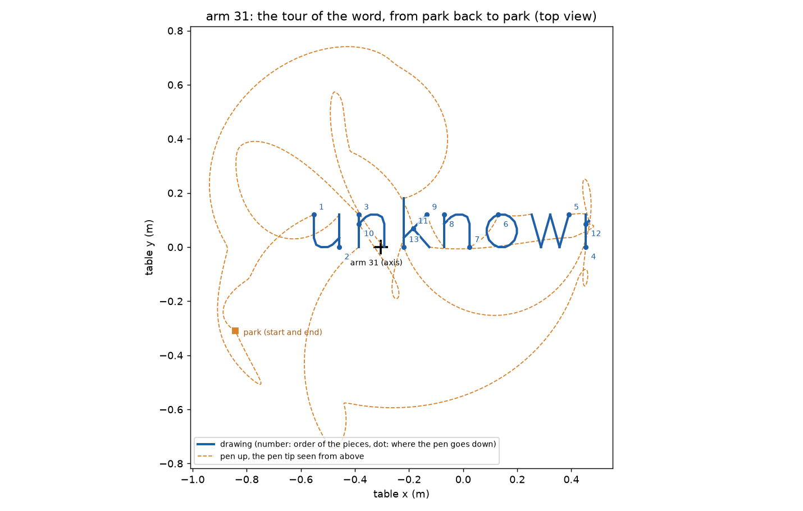

# sequencer — the tour of one arm

**Job.** The local planner says how each piece of the drawing can be drawn (a bunch of up to
four alternative plans per piece). The sequencer decides which alternative, in which order and
in which direction, and fills in everything between the pieces: the pen coming off the paper,
the move to the next piece, the pen going down again. Out comes the arm's whole job as a list
of timed motions, from where the arm stands back to where it should end.

Files: `aris/sequencer/tour.py` (the loop and the report), `lift.py` (lift-off and set-down),
`draw.py` (drawing motions), `guard.py` (what the sequencer checks itself).

## In and out

`tour(arm, bunches, q_start, obstacles, rules, q_end=None, free_options=None)`

- **In:** the arm, the local planner's bunches, where the arm is, the obstacles (base frame),
  the drawing rules (draw speed, lift height 25 mm, speed share, gates), where the arm should end
  (default: where it started), and settings for the free-space planner.
- **Out:** a generator. It hands out `Motion`s one at a time, in order, and at the end returns
  the pieces it could not draw (`Leftover`, reason and detail). `tour_all` collects everything;
  a `TourReport` passed in is filled as it goes (pieces, lifts, drawing time, pen-up time and
  share, longest free motion, joint travel of the moves, free-space calls and refusals, time
  to the first motion, CPU and wall time).

Per piece it hands out four motions (more where a drawing is cut, below):

| motion | kind | what |
|---|---|---|
| move | free | from where the arm is to the piece's first lift-off configuration (free-space planner) |
| set-down | free | the pen straight down onto the paper: the lift-off flown backwards |
| drawing | draw | the piece, pen on the paper |
| lift-off | free | the pen straight up 25 mm at the end of the piece |

and at the end one move to `q_end`. Every motion starts exactly where the one before ended
(to 1e-9 rad), starts and ends at rest, and ends in a configuration the arm can hold: before a
motion is handed out, its end is checked with the kernel (joint-limit margin, clearance to
every obstacle, the arm against itself; with the pen exempt from the paper where it is meant to
touch it). An empty drawing gives only the move to `q_end` (nothing, if the arm is already
there).

## How the next piece is chosen

Greedy. From where the arm is, every piece still to draw is priced in each of its alternatives
and both directions: the time the slowest joint needs to reach that alternative's first drawing
configuration at the allowed speed (joint distance divided by 0.3 of the joint speed limit).
That costs nothing, so no free-space move is planned just to compare candidates (lesson L75).
The cheapest is tried: its lift-offs and drawing motion are made, then the free-space planner
is asked for the move. If anything refuses, the next cheapest is tried. Ties go to the earlier
piece, so the same input always gives the same tour, also from a fresh process.

## The lift-off

The drawing configuration with the pen tip raised 25 mm straight up along the paper normal, by
a short move: the IK is solved every 2 mm of rise, each answer the one nearest the last, so
the arm keeps its shape (the same IK branch; a jump over 0.05 rad means it cannot). Every sample
must pass the gates (joint-limit margin, singular value), the timed move must be free as flown
(the pen is exempt from the paper, it is on its way to or from it), and the arm must be able to
stand at the top with the pen judged against the paper too. The set-down is the same timed
motion flown backwards. The lift-off is the nearest pen-up configuration to the drawing one,
never one picked for clearance somewhere else (lesson L53).

Holding the hand's orientation and joint 7 exactly sometimes fails: a joint-limit margin, a
change of shape, or a parked neighbour that the elbow swings toward as the arm rises (lesson
L7). Then joint 7 and the hand's turn about the paper normal are allowed to change a little on
the way up (up to 0.5 rad each, smallest first); the tip still goes straight up. On the fixed
cases this recovered 0.5 m of the word for arm 13 and several rim lines.

A piece whose alternatives all lack a lift-off (at either end, in either direction) becomes a
leftover `no_free_path`, "no lift-off at its start/end", with the reason of the first try.

## The drawing motion

The local planner's joint path is timed here in one call (`kernel.retime`, pen within 0.1 mm of
the planned pen path) and checked as flown against every obstacle. Two corrections, both
because of what the checker measures:
- **Sharp corners.** At a corner sharper than 120 degrees the drawing is cut into two motions
  that stop there with the pen down. The timing slows the pen a lot at such a corner anyway; the
  checker reads the speed along the line from the nearest point of the line, which at a rounded
  sharp corner falls back for an instant and fails "never stops".
- **Pen speed.** Between its samples the flown curve can run up to 3 % faster than the draw
  speed where the pen speeds up or slows down (the timing holds the speed along the path, not
  the pen's). The pen speed is read at 1 kHz; if it is over by more than 1 %, the draw speed asked
  of the timing is lowered by that much and the path is timed again. (Better fixed in
  `kernel.retime`.)

A drawing that cannot be timed or flown makes the candidate unusable; if no alternative works
the piece is a leftover `unreachable`, "drawing: ...".

## When the free-space planner refuses

The refusal counts only from where the arm is; the next cheapest candidate is tried (another
alternative, another piece). A piece all of whose candidates were refused from here becomes a
leftover `no_free_path` with the refusals. After 12 refusals in one step the pieces refused so
far become leftovers and the step starts again with the rest. On the fixed cases below the
free-space planner never refused (0 of 382 calls). If the final move to `q_end` is refused, the
report says so (`end_refusal`); the last motion still ends holdable.

## What the checker says

Every motion of every case was given to the independent checker. None passes outright, and
every failure is one of two disagreements that are not the sequencer's to settle:

1. **Link 1 and its own struts.** Since commit f371483 (struts 30 mm longer) the planners treat
   link 1 like the base: it keeps 0.020 m to its own hanger steel, checked once over the turn of
   joint 1. The checker still asks 0.050 m of it on every motion: link 1 reads about 39 mm from
   its narrow strut (38.9 mm at the closest), whatever the arm does. Needs the checker brought in step.
2. **The pen at the drawing end of a set-down or lift-off.** Those are free motions, and the
   checker asks every free motion to keep the lifted pen 3 mm off the paper. One end of these
   two is the drawing configuration, pen on the paper: the pen's round end reads 0.3 to 1.3 mm
   into the paper there (its 5 mm radius at the pen's lean). Needs a contract decision: a motion
   kind for pen-down/pen-up, or the checker exempting the pen along the lift.

`tests/arm_cases.py` (`known_disagreement`) sorts every failed row: a failure counts as known
only if it is one of these two, within the numbers given. All 1 507 motions of the fixed cases
fail only on these.

## What it cannot do

- Greedy on the move to the next piece only; it does not look at where a piece leaves the arm.
  On the word, a better order of the same alternatives (moving one piece at a time, with the
  same price) prices the moves about 20 % lower (17.4 against 21.6 s), on a corpus drawing 6 %.
  The next lever: choose order, alternative and direction together along the tour
  (OPTIMIZATION_NOTES 13, lesson L54).
- The price is a lower bound on the move's time; the free-space moves took 1.1 to 3 times it,
  and a detour up to 9 times.
- A piece refused from where the arm is may be reachable from elsewhere; it is not offered
  again later.

## Measured (2026-09-30, machine load 6 to 11 on 32 cores, one process)

From park back to park; obstacles of the arm's leading phase (arm 31 phase 2, arm 13 phase 1);
kinematic table on; drawing speed 20 mm/s. Planning time includes the local planner. "Moves" is
the joint-space path length of the moves between pieces. Pen-up time is every free motion
(moves, set-downs, lift-offs). No hatch lines lie within 0.80 m of arm 31.

| arm, case | lines | pieces drawn | planning CPU / wall s | first motion s | drawing s | pen up s | pen-up share | longest free s | moves rad | leftovers (m) |
|---|---|---|---|---|---|---|---|---|---|---|
| 31 word | 13 | 13 | 2.5 / 2.5 | 1.6 | 122.8 | 43.1 | 0.260 | 7.6 | 49.6 | unreachable 0.198 |
| 31 scatter | 27 | 22 | 4.5 / 4.6 | 3.2 | 140.9 | 83.0 | 0.371 | 13.2 | 94.9 | blocked 0.320, no path 0.177, unreachable 0.111, too short 0.002 |
| 31 starburst | 24 | 25 | 12.3 / 12.5 | 9.7 | 706.9 | 66.2 | 0.086 | 8.3 | 68.0 | blocked 0.908, no path 0.417, unreachable 0.429 |
| 31 spiral | 3 | 7 | 10.9 / 10.9 | 8.9 | 455.7 | 28.9 | 0.060 | 6.0 | 36.7 | blocked 1.135, unreachable 0.278 |
| 31 duotone | 5 | 5 | 4.2 / 4.2 | 2.7 | 207.0 | 35.3 | 0.146 | 9.4 | 41.1 | blocked 0.411, unreachable 0.208 |
| 31 lines | 100 | 103 | 38.2 / 38.4 | 28.5 | 2240.3 | 178.7 | 0.074 | 7.5 | 138.7 | blocked 2.325, no path 0.198, unreachable 0.015 |
| 13 word | 13 | 12 | 2.1 / 2.1 | 1.4 | 121.3 | 31.9 | 0.208 | 4.9 | 36.6 | unreachable 0.199, blocked 0.014 |
| 13 hatch | 43 | 43 | 19.7 / 19.7 | 13.6 | 1515.5 | 60.0 | 0.038 | 4.7 | 42.0 | none |
| 13 scatter | 24 | 23 | 2.7 / 2.9 | 1.9 | 142.3 | 57.6 | 0.288 | 5.9 | 61.3 | blocked 0.164, unreachable 0.011 |
| 13 starburst | 5 | 6 | 2.0 / 2.0 | 1.7 | 53.1 | 24.0 | 0.312 | 9.2 | 23.8 | blocked 0.489, unreachable 0.163 |
| 13 spiral | 3 | 2 | 1.7 / 1.8 | 1.6 | 73.8 | 6.5 | 0.081 | 2.9 | 5.7 | blocked 0.523, unreachable 0.147 |
| 13 duotone | 5 | 4 | 4.1 / 4.3 | 3.2 | 176.0 | 19.3 | 0.099 | 5.8 | 23.6 | blocked 0.286, unreachable 0.606 |
| 13 lines | 100 | 104 | 33.5 / 33.8 | 24.1 | 2213.2 | 172.2 | 0.072 | 5.5 | 130.1 | blocked 1.652, no path 0.250, unreachable 0.014 |

- Every lift and set-down takes 0.25 to 0.35 s; the moves between pieces 34 s of the word's 43 s
  pen-up time for arm 31.
- The sequencer's own CPU (lift-offs, timing the drawings, the moves, the checks) is 0.8 to
  1.0 s for the word, 9.6 to 9.8 s for 100 lines; the rest is the local planner.
- Free-space planner: 382 calls, 0 refusals. The leftovers "no path" (6 pieces, 1.04 m) are all
  pieces without a lift-off at one end: a joint-limit margin, a change of shape 2 mm up, or
  within 0.15 mm of the clearance.
- **Against the old planner, word, arm 31.** Old: planned in 66.8 s, its motion took 67.8 s (it
  drew at 80 mm/s). New: planned in 2.5 s of CPU (first motion after 1.6 s); at 20 mm/s the
  motion takes 165.9 s (122.8 drawing, 43.1 pen up); at the old 80 mm/s 82.3 s (39.2 drawing,
  43.1 pen up, 13 pieces, 0.198 m of the last "n" beyond the reach).

Tests: `tests/test_sequencer.py` (the price, the lift-off going straight up and the set-down
being the same backwards, cutting at corners, an empty drawing, a start nothing can leave, a
piece under a box that is left over while the rest is drawn).
