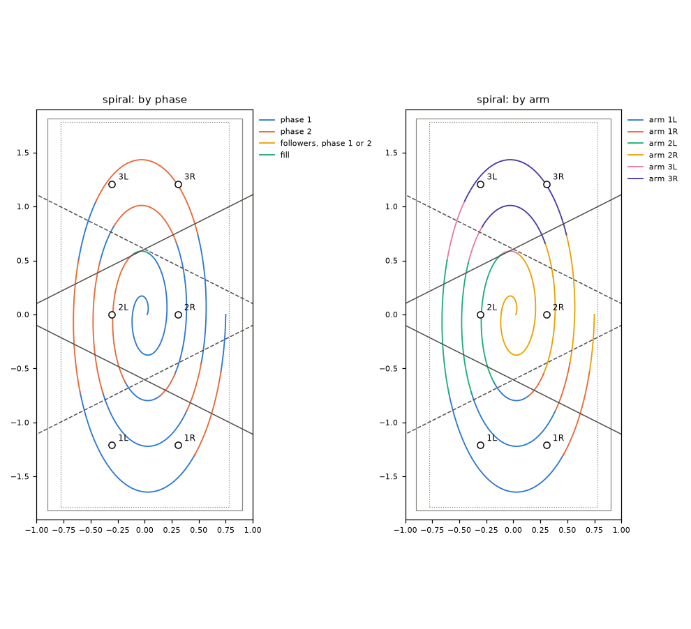

# system — which arm draws which line, in which phase

**Job.** The system planner takes a whole drawing and decides which arm draws each line, in
which phase and behind which walls. It runs the arm planners and hands out their motions as
they come, each tagged with its phase and arm. At the end it says what was not drawn and why.
It only ever calls the arm planner. It implements Pete's scheme (DESIGN.md section 3): leaders
first, then the followers against the leaders' footprints (step 2), then the fill phases.

Files: `aris/system/`:
- `planner.py`: the one call
- `phases.py`: the phases
- `maps.py`: the drawable maps
- `area.py`: the drawing area
- `allocate.py`: the laws of who draws what
- `followers.py`: step 2, a leader's footprint handed to its follower
- `run.py`: the arm planners of a phase, in parallel
- `account.py`: the no-drop account
- `stretch.py`: part of a line
- `settings.py`: the knobs

## In and out

`plan(rig, lines, rules=None, arm_configs=None, cache_dir=None, workers=1, verify=None)`

- **In:**
  - the rig;
  - the drawing: lines in the table frame, each with its own id;
  - the drawing rules: default `rig.rules()`, from rig.json, which is the only source;
  - where each arm stands: default, its park;
  - a directory for the drawable maps and the local planner's kinematic table (none: built
    every time);
  - how many processes to use;
  - `verify(arm_id, phase, fields, motion, q_before) -> dict`: the independent checker, from
    the server. It must be picklable, because the arm planners run in worker processes.
- **Out:** a generator of `(phase name, arm id, Motion)`, in the order the arm planners produce
  them. At the end it returns the leftovers.
  - Every drawing motion's `piece` is in the input line's own id and arc length.
  - `plan_all` collects everything; `plan_detailed` also returns a report: per phase and arm,
    times, lengths and what came back; the phases skipped and why; the drawing area.
  - `phase_named(rig, name)` gives the `Phase` a name stands for.
  - `check_view(rig, phase, arm, report)` gives the Phase and footprints an arm's motions are
    checked in; `execution_phase(rig, phase)` gives the phase as the arms run it, followers
    included.

## Checked as planned

Each arm planner gets `verify` with the arm, its Phase and its footprints bound
(`functools.partial`, `check_view`):
- a leader or a fill arm: its own phase and no footprints;
- a follower: the phase as it sees it, with its leader's footprint.

The arm planner hands on only motions the checker passed, each carrying the verdict as
`Motion.checked`. A piece with a refused motion comes back as "failed_check", and like any
stretch handed back it flows on to the phases after. If no later phase draws it, it is left
over with that reason and the arm and phase that refused it.

The report counts, per phase and arm, the motions handed on with a verdict (`checked`) and
the length handed back as `failed_check`. It also keeps the tightest checked clearance over
every motion (`Report.tightest`, `tightest_at`). With `verify=None` nothing is checked here.

**Tested with a fake checker** that refuses every motion of one line for slot 1L:
- 1L hands the line back in phase 1;
- 1R draws what its maps hold in phase 2 and in fill 1R+3R;
- the 2.6 cm at the line's start that only 1L reaches is refused again in fill 1L+3L and
  left over as "failed_check, fill 1L+3L, arm 1L";
- every motion handed on carries a passing verdict.
- **Refusals:**
  - A drawing with any point outside the drawing area (below) is refused before anything is
    planned. The generator yields nothing and returns a `Refusal("outside_drawing_area")`
    naming the line, the point and the area.
  - An arm away from its park that does not move in phase 1 is an error.

## The drawing surface

The system planner gives every point of the drawing its height: the paper less the pen's press
(`rules.press`, 3.5 mm for the 2 mm 4H pen, from the rig's pen table). The planners below put
the pen tip where the points are and know nothing about pens. The real paper stays the plane
that the links and the holder must clear, and the plane from which the lifts are measured. The
drawable maps are computed with the pen tip on that surface too.

## The laws

1. **A phase is one entry of a fixed list.** Every arm that moves in it plans alone, from its
   park back to its park, against its own obstacles: the paper, its steel, the walls next to
   it and the parked arms.

   | phase | moving | parked | walls |
   |---|---|---|---|
   | 1 | 1L, 2R, 3L | 1R, 2L, 3R | 1L-2R, 2R-3L |
   | 2 | 1R, 2L, 3R | 1L, 2R, 3L | 1R-2L, 2L-3R |
   | fill 1L+3L | 1L, 3L | the other four | none |
   | fill 1R+3R | 1R, 3R | the other four | none |
   | fill 2L, fill 2R | that arm alone | the other five | none |

2. **A stretch goes to the first phase and arm whose drawable map holds every point of it.**
   The arm planner is the judge. What it hands back flows to the next phases.
3. **A line no map holds whole is cut into the longest stretches some map holds**, in phase
   order, with one join of `min_piece` (1 cm, drawn twice) between neighbouring stretches.
   **A stretch goes to a fill phase only when the leader phases hold less than 80 % of it.**
4. **Parts of one line given to the same arm in the same phase are one job.**
5. **The account: drawn plus left over equals the input; anything else is a bug.**

- A phase with nothing to do is not run.
- A phase whose arms drew nothing is not reported as a phase.
- Both kinds of phase are listed as skipped, with the reason.
- The walls keep the arms of a phase apart by construction; the independent checker confirms
  it.

**Why 1L with 3L and 1R with 3R may fill together.** The ends of a column hang 2.42 m apart.
No part of an arm, pen included, gets further than 1.150 m from its own first joint's axis.
That is a bound from the arm model, not a sample; sampled, the furthest is 1.02 m. So the two
stay 0.121 m apart, against 0.053 m demanded. Slots 2L and 2R each reach another arm, so they
fill alone (`phases.fill_groups`, tested).

## Step 2: followers in the leader phases (off by default)

`Settings(followers=True)` turns this on. It is off by default because, under the five laws,
followers draw nothing on any test drawing and cost 3 to 25 times the planning time (see
"Measured").

In phases 1 and 2, once a leader has planned, its footprint becomes one more obstacle for its
row partner. The footprint is everywhere the leader's body goes during the phase: all its
motions, plus its park, as a distance field with 1 cm cells and a margin of the arm-to-arm
clearance. It is expressed in the partner's base frame.

The follower's obstacles are then:
- its own steel and the paper;
- its leader's walls, held on its own side;
- the footprint.

Nothing stands parked. Its drawable map is computed against these obstacles after the leader
has planned, so it depends on the plan and is never cached.

The follower's job is what that map holds whole, taken from two places:
- what the leader handed back;
- what waits for a fill phase.

It plans that from its park back to its park, and what it hands back flows on. Its motions
carry the phase's name. There is no timing between leader and follower: the follower avoids
everywhere the leader will ever be in that phase.

How a follower's motions are checked (`phases.follower_phase`):
- the phase as the follower sees it: its leader's walls, nothing parked;
- the leader's footprint, passed to the checker as `check(..., fields=)`, from the report
  (`Report.fields`);
- `check_phase_end` covers every arm that moved.

The footprints and follower maps are built only if some follower, alone, could hold one of
those stretches whole.

## Drawable maps

For every arm in every phase there is a grid over the canvas, 2 cm apart. A grid point is
drawable when at least one way of holding the pen there passes the local planner's own node
test:
- joint limits;
- the smallest singular value;
- the arm against the paper and against itself;
- the obstacles of that phase.

The pen is upright, with 8 hand turns and every elbow value and arm shape. A point of a line
is held by a map when its nearest grid point is drawable. The maps are cached under a digest
of the arm, its pose and tool, the phase's obstacles, the gates and the grid. They take 5.5 to
7 s of CPU each, 12 s for all twelve in 12 processes.

Coverage of the canvas at the gates of rig.json (sigma_min 0.04; the same as at 0.08, to the
grid):

| phase | per arm | together |
|---|---|---|
| 1 | 1L: 0.236, 2R: 0.239, 3L: 0.238 | 0.713 |
| 2 | 1R: 0.236, 2L: 0.238, 3R: 0.237 | 0.711 |
| fill | 1L: 0.252, 3L: 0.255; 1R: 0.253, 3R: 0.254; 2L: 0.272; 2R: 0.273 | |
| all phases | | 0.992 |

## The drawing area

`plan` reads the area and its centre from the rig (`rig.drawing_area_m`,
`rig.drawing_area_centre_m`, default the table centre). Before planning anything it refuses:
- if the file has no area;
- if the file's area is larger than the maps give by more than one grid cell;
- if any point of the drawing lies outside the area about its centre.

The drawing area is the largest rectangle about the given centre, with sides along the table,
that lies inside the union of all maps shrunk by 2 cm (`area.py`). Drawings must lie inside
it; the drawing server scales them about the centre to fit.
- **Six slots, centre (0, 0):** **1.56 x 3.56 m**, against the canvas's 1.80 x 3.63 m (85 % of
  the area). It is unchanged on the drawing surface and on the new steel.
- **Two arms (`config/two_arms`, slots 2R and 3R), centre (0, 0.605):** 0.32 x 2.23 m. The two
  arms hang at x = +0.305, and at the centre's x = 0 the valley between their reaches lies
  0.16 m to the left. About (0.305, 0.605) it is 0.95 x 2.23 m; about (0.2, 0.605),
  0.72 x 2.23 m. The file says 1.2 x 1.6, which the maps do not hold.

## Measured (2026-10-02, slots, pen 2 mm 4H: press 3.5 mm, 15 mm/s on paper; followers off; machine load 18 to 27; 30 processes; maps cached)

The seven drawings of `tests/system_cases.py`, each scaled to the drawing area:
- word: "unknown", 0.55 m wide at the table centre;
- hatch: 40 lines 1.5 m long;
- scatter: 80 short lines;
- starburst: 24 rays;
- spiral: 4 turns;
- duotone: 10 wavy bands the length of the area;
- random 300: 300 random lines, 5 cm to 1.5 m long.

Drawing speed 20 mm/s. "Phases 1 + 2" answers Pete's question: how much one 1-2-1 / 2-1-2
alternation draws.

| case | length m | drawn | phases 1 + 2 | of which followers | fill | cuts | left over | planning CPU / wall s | first motion s | on the rig s (phases) | checker |
|---|---|---|---|---|---|---|---|---|---|---|---|
| word | 1.30 | 1.000 | 1.000 | 0 | 0 | 0 | none | 13 / 2.5 | 1.5 | 152 (152) | 53 / 53 |
| hatch | 60.00 | 1.000 | 0.999 | 0 | 0.008 | 44 | < 1 mm | 142 / 23 | 5.0 | 2143 (1043 + 1066 + 34) | 400 / 400 |
| scatter | 9.59 | 1.000 | 0.980 | 0 | 0.020 | 0 | none | 70 / 9.2 | 4.4 | 509 (359 + 131 + 20) | 327 / 327 |
| starburst | 29.36 | 1.000 | 0.995 | 0 | 0.011 | 18 | none | 77 / 12 | 2.5 | 1419 (699 + 695 + 25) | 204 / 204 |
| spiral | 16.91 | 1.000 | 1.001 | 0 | 0.009 | 17 | none | 47 / 9.5 | 2.3 | 672 (368 + 284 + 21) | 111 / 111 |
| duotone | 35.29 | 1.000 | 1.000 | 0 | 0.007 | 24 | none | 97 / 15 | 4.8 | 956 (462 + 472 + 23) | 208 / 208 |
| random 300 | 179.67 | 1.000 | 0.988 | 0 | 0.017 | 97 | < 1 mm | 355 / 59 | 7.4 | 6334 (3339 + 2734 + 156 + 47 + 32 + 26) | 1715 / 1715 |

- Inside the drawing area every drawing is drawn completely. Phases 1 + 2 draw 99 to 100 %
  of it (over 1 where the joins are drawn twice).
- **Against the last table (20 mm/s, no press):** the same drawn shares. The rig times are 33
  to 54 % longer: word 100 to 152 s, hatch 1 615 to 2 143, scatter 331 to 509, starburst
  1 062 to 1 419, spiral 502 to 672, duotone 699 to 956, random 4 588 to 6 334. Drawing at
  15 mm/s instead of 20 accounts for a third more drawing time. The rest is the sequencer's
  slower set-down (it now lands at 10 mm/s), which weighs most on drawings of many short
  pieces (word and scatter).
- **The drawing surface:** every point is planned 3.5 mm below the paper. The lifts still
  end with the pen tip 22 mm above the real paper, because the sequencer measures the lift from
  the paper plane. No planner below needs to know the press.
- **Followers draw nothing on any case.** What waits for a fill phase is 0 to 2 % of a
  drawing: rim bits and the patches where the walls cross. Each leader's footprint covers 41 to
  100 % of what its follower could draw with the leader parked. Of that, the field's own
  conservatism is 0 to 1 % (measured with the leader standing at its park); the rest is where
  the leader really goes. The fill phases and the rig time are unchanged.
- **The price of step 2 is planning time.** Footprints and follower maps are built in every
  leader phase with something waiting: planning wall 41 to 84 s against 6 to 30 s without,
  and CPU doubled. The rig time is not affected.
- **Checker:** all 3 018 motions pass `aris.check.check` with their phase, and the smallest
  clearance beyond the demanded one is 0.6 mm. `check_phase_end` passes after all 22 phases
  that ran.
- **Corrected struts:** on the steel from the technical drawing the fill maps shrink by
  0.1 point; the leader maps and the drawing area (1.56 x 3.56 m) do not change. With
  followers off, every number is within 1 % of the previous table.
- **Rig time:** each phase lasts as long as its busiest arm. In phase 1 of the random lines,
  slot 2R works 2 368 s. Nothing balances the arms yet.
- **Before the drawing area** (whole-canvas drawings at the old gates), the same laws left
  only what lies beyond every arm's reach: spiral 13 mm, starburst 0.25 m, duotone 0.05 m,
  random 0.27 m.

Figures for the other cases: `figures/system_scatter.png`, `system_starburst.png`,
`system_duotone.png`, `system_random.png`. The left panel is coloured by phase, the right by
arm. Leftovers are red. Phase 1 walls are solid and phase 2 walls dashed. The dotted
rectangle is the drawing area.

## What it cannot do (yet)

- **Followers get almost nothing to do.** The leader phases already take 98 to 100 % of every
  drawing. What waits for a fill phase lies mostly in the two small patches where the walls
  of both phases cross; a follower keeps behind its leader's walls, so it cannot reach them.
  A leader's footprint also covers 41 to 100 % of what its follower could otherwise draw.
  Followers would only help the rig time if they took work from their leaders before the
  leaders plan (a different law: a question for Pete).

- **Nothing balances the arms of a phase.** The rig time is the sum of the phases, each as
  long as its busiest arm.
- A stretch an arm refuses is offered to the phases after only, never to the same arm again.
- The maps judge single points with the pen upright. A stretch they hold can still fail as a
  whole; it then flows on to the next phases.

## Tests

`tests/test_system.py`, quick set in 40 s:
- the maps of one phase build, are cached and read back;
- hand-made lines land where expected;
- the laws on toy maps: whole, the cut with its join, the 80 % rule, a hole in a leader's map
  filled with joins at both ends, nothing holding a line;
- parts that meet are one;
- the fill pairs cannot touch;
- the account raises on a drop, a double and a stranger;
- a follower sees its leader's footprint (the leader's body inside it; with the leader
  standing, the follower loses at most 10 % against a parked leader, on a 5 cm grid);
- a drawing outside the area is refused, and so is a stale or missing area in the rig;
- each arm is checked in its own view;
- a line the checker refuses for one arm flows on and is left over as failed_check where no
  other arm reaches it;
- a small drawing runs end to end on slots 1L and 2R in two processes, joined from park to
  park, with the same result from one process.

Slow test: the word end to end through the checker and `check_phase_end`, and the drawing
area of rig.json equal to the one the maps give.
