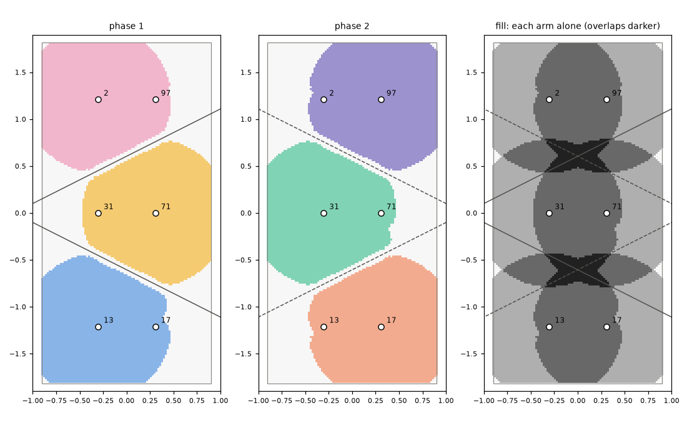
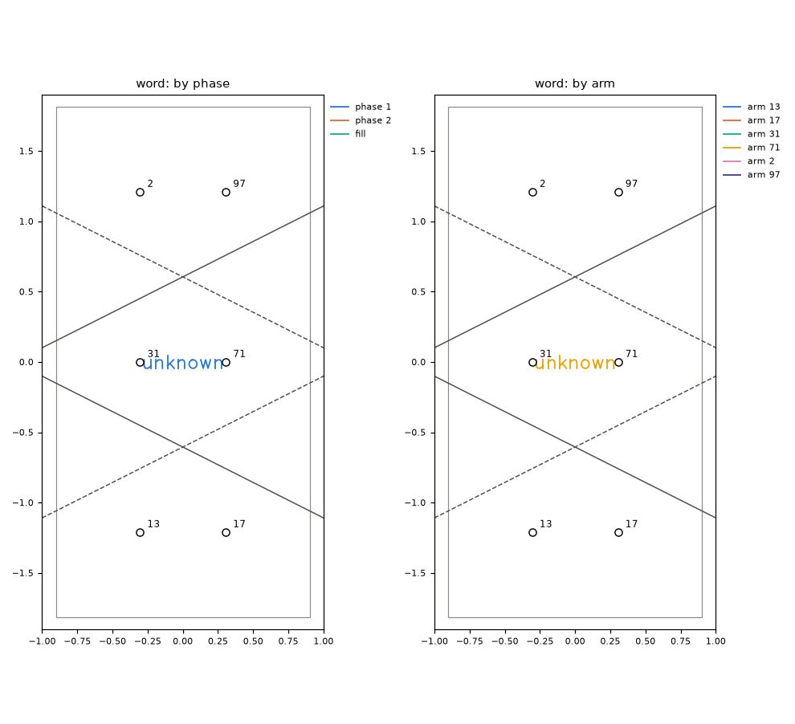
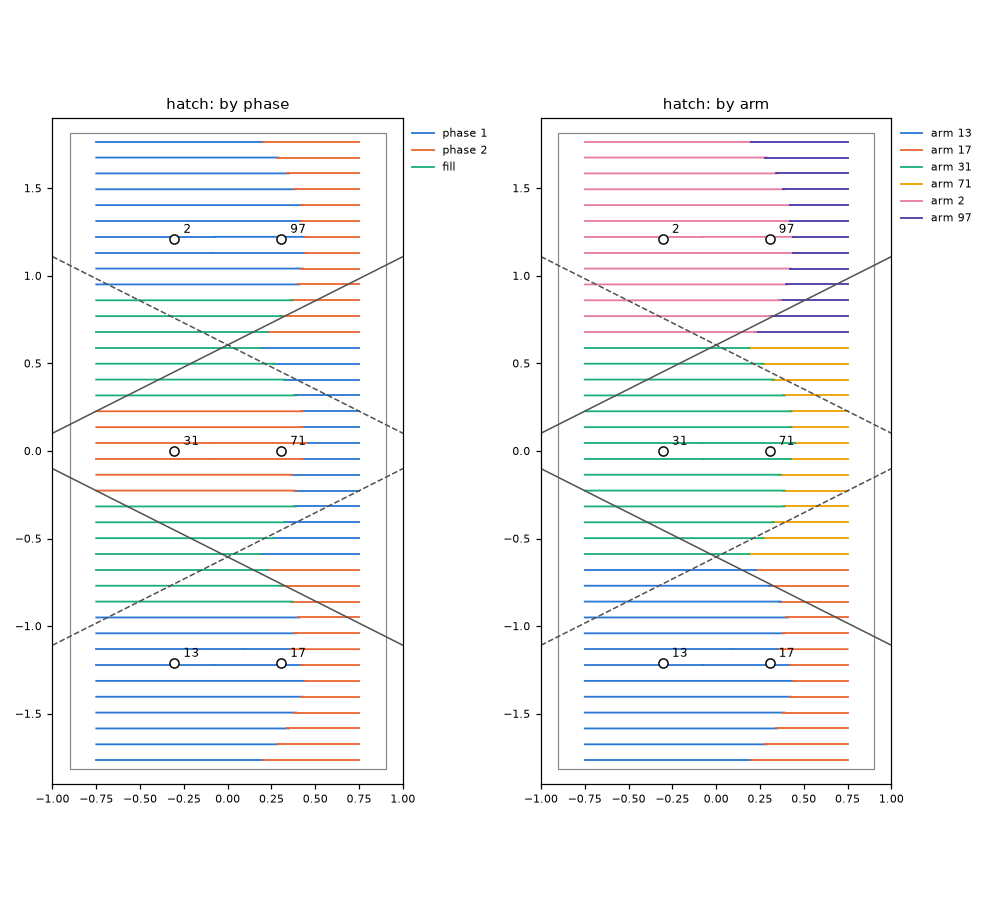

# system — which arm draws which line, in which phase

**Job.** Takes a whole drawing and decides which arm draws each line, in which phase and
behind which walls; runs the arm planners and hands out their motions as they come, each
tagged with its phase and arm; at the end, says what was not drawn and why. It only ever
calls the arm planner. This is step 1 of Pete's scheme (DESIGN.md section 3): leaders only,
followers parked.

Files: `aris/system/` — `planner.py` (the one call), `phases.py`, `maps.py` (drawable maps),
`allocate.py` (who draws what, and the cut), `run.py` (the arm planners of a phase, in
parallel), `account.py` (the no-drop account), `stretch.py` (part of a line), `settings.py`.

## In and out

`plan(rig, lines, rules, arm_configs=None, cache_dir=None, workers=1)`

- **In:** the rig, the drawing (lines in the table frame, each with its own id), the drawing
  rules, where each arm stands (default: its park), a directory for the drawable maps and the
  local planner's kinematic table (none: built every time), and how many processes to use.
- **Out:** a generator of `(phase name, arm id, Motion)`, in the order the arm planners produce
  them, which at the end returns the leftovers. Every drawing motion's `piece` is in the input
  line's own id and arc length. `plan_all` collects everything; `plan_detailed` also returns a
  report (below). `phase_named(rig, name)` gives the `Phase` a name stands for, which is what
  the checker needs.
- An arm away from its park must move in the first phase (phase 1); otherwise `plan` refuses
  with an error, since every phase assumes the arms it does not move stand parked.

## Phases and walls

A phase is who moves, who stands parked, and the walls between those who move.

| phase | moving | parked | walls |
|---|---|---|---|
| 1 | 13, 71, 2 | 17, 31, 97 | 13-71, 71-2 |
| 2 | 17, 31, 97 | 13, 71, 2 | 17-31, 31-97 |
| fill 13, fill 17, ... fill 97 | that arm alone | the other five | none |

The fill phases run after phases 1 and 2, one per arm in the rig's order, and only for arms
that have something to draw. Every moving arm plans alone against its own obstacles (the
paper, its steel, the walls next to it, the parked arms it can reach), from where it stands
back to its park. The walls keep moving arms apart by construction, so no arm needs to know
about another; the independent checker confirms it afterwards. Every phase ends with every arm
at its park, so every phase starts from all arms parked.

## Drawable maps

For every arm in every phase: a grid over the canvas, 2 cm apart. A grid point counts as
drawable when at least one way of holding the pen there passes the local planner's own test of
a configuration (joint limits, singular value, the arm against the paper and itself, then the
obstacles of that phase). Pen square to the paper, 8 hand turns, every elbow value and arm
shape. The test is the local planner's graph layer itself, so the map and the planner judge a
configuration the same way. 12 maps, 5.5 to 7 s of CPU each (8 s for all of them with 12
processes), kept in the cache directory under a digest of the arm, its pose and tool, the
phase's obstacles, the gates and the grid.

Share of the canvas each map covers:

| phase | per arm | together |
|---|---|---|
| 1 | 13: 0.238, 71: 0.243, 2: 0.240 | 0.721 |
| 2 | 17: 0.238, 31: 0.242, 97: 0.239 | 0.719 |
| each arm alone | 13: 0.253, 17: 0.254, 31: 0.273, 71: 0.274, 2: 0.255, 97: 0.254 | |
| every phase together | | 0.992 |

What no map covers (0.8 %) is the canvas rim beyond every arm's reach: the four corners and the
long edges level with the walls.

## Who draws what

Before each phase, every stretch still waiting for an arm is allocated over this phase and the
ones after it:

- **Whole first.** A line goes to the first phase and arm (phases in order, arms in the phase's
  order) whose map holds all of it: every point, 4 mm apart, judged against the map shrunk by
  one grid step so that a point at the map's edge does not count.
- **Cut with overlap.** A line no map holds whole is cut. From its start, take the phase and
  arm whose map holds the longest run from there; the next piece starts where that run ends,
  reaching back 1 cm (`rules.min_piece`) over the join, so the join is drawn twice rather than
  not at all.
- **Out of reach.** Where no map holds the line, that stretch is left over as "unreachable".
- A stretch keeps the arm it was given. Stretches under 1 cm are left over as "too short".

The arms of a phase then plan at the same time, one process each; the motions go out as they
arrive. What an arm could not draw (blocked, no path, anything) goes back into the pool with
its reason and is offered to the phases after; if none of them can take it, it is a leftover
with that reason.

## The no-drop account

`account(lines, motions, leftovers)` checks the result against the drawing, from the motions
actually produced (a drawing motion's `piece`), never from the plan. For every line, the drawn
pieces and the leftovers together must cover it from end to end; nothing may lie outside a
line or belong to no line; two stretches may overlap only by a join (1 cm). Anything else is a
bug in the planner and raises `NoDropViolation`. It passed on every case below.

## Measured (2026-09-30, machine load 10 to 35 on 32 cores, 30 processes, maps cached)

Whole-canvas drawings (`tests/system_cases.py`): the word "unknown" 0.55 m wide at the table
centre, between arms 31 and 71; hatch, 40 lines 1.5 m long across the canvas; scatter, 80
short lines; starburst, 24 rays from the centre; spiral, 4 turns stretched to the canvas;
duotone, 10 wavy bands the length of the canvas; 300 random lines 5 cm to 1.5 m long. Drawing
speed 20 mm/s. "Phases 1 + 2" answers Pete's question: how much one 1-2-1 / 2-1-2 alternation
draws.

| case | length m | drawn | phases 1 + 2 | fill | left over m | planning CPU / wall s | first motion s | on the rig s (phases) | checker |
|---|---|---|---|---|---|---|---|---|---|
| word | 1.30 | 1.000 | 1.000 | 0 | none | 13 / 1.7 | 1.3 | 97 (97) | 53 / 53 |
| hatch | 60.00 | 1.000 | 0.762 | 0.245 | none | 121 / 17 | 3.4 | 1773 (606 + 388 + 166 + 442 + 170) | 353 / 353 |
| scatter | 9.59 | 1.000 | 0.980 | 0.020 | none | 60 / 5.8 | 2.3 | 329 (229 + 86 + 14) | 327 / 327 |
| starburst | 32.57 | 0.989 | 0.807 | 0.187 | unreachable 0.34 | 73 / 11 | 2.9 | 1158 (406 + 415 + 168 + 168) | 196 / 196 |
| spiral | 17.79 | 0.949 | 0.451 | 0.505 | no path 0.82, unreachable 0.08 | 38 / 12 | 1.1 | 686 (96 + 92 + 0 + 96 + 263 + 70 + 69) | 86 / 86 |
| duotone | 35.99 | 0.993 | 0.642 | 0.356 | unreachable 0.25 | 72 / 17 | 2.1 | 1334 (294 + 303 + 155 + 228 + 215 + 140) | 178 / 178 |
| random 300 | 185.91 | 0.995 | 0.739 | 0.261 | unreachable 0.58, no path 0.27, too short 0.004 | 304 / 39 | 5.8 | 5619 (1774 + 1210 + 434 + 433 + 867 + 530 + 159 + 212) | 1568 / 1568 |

- Shares are of the drawing's length. Phases 1 + 2 and fill add up to a little more than
  "drawn" because the joins are drawn twice (0 to 0.7 m per case).
- **Checker:** all 2 761 motions pass `aris.check.check` with their phase; the smallest
  clearance beyond the demanded one is 0.8 mm (duotone). `check_phase_end` passes after all
  33 phases.
- Per arm: the time to its first motion is 0.2 to 5 s from the start of the phase; the arms of
  one phase plan in 1 to 10 s of wall time. The phase lasts as long as its slowest arm, so the
  rig time is dominated by the busiest arm of each phase: phase 1 of the 300 lines is 1 774 s
  for arm 71 against 1 327 s and 1 389 s for its two partners.
- The word lands whole on arm 71 in phase 1 (its region reaches over the whole word), so it
  takes one phase of 97 s; arms 31 and 71 never share it.
- "No path" leftovers are pieces whose lift-off fails at one end (the sequencer finds no
  straight lift of the pen, see sequencer.md). On the spiral one 1.77 m piece near arm 13 came
  back from phase 1 and again from fill 13; fill 17 and later took 0.95 m of it, 0.82 m was left.
- Planning CPU counts every process (including the local planner's workers, whose start-up
  alone is most of the word's 13 s); maps are cached, 0.2 s to read.

Figures for the other cases: `figures/system_scatter.png`, `system_starburst.png`,
`system_spiral.png`, `system_duotone.png`, `system_random.png`. Left panel by phase, right
panel by arm, leftovers in red, phase 1 walls solid, phase 2 walls dashed.

## What it cannot do (yet)

- **Followers do not draw (step 2).** In phases 1 and 2 the three followers stand parked.
  Step 2: after a leader has planned its phase, its footprint (everywhere its body goes) is
  handed to its row partner as one more obstacle, and the partner draws what it can next to it.
  That would move work out of the fill phases, which today are 19 to 51 % of the drawing on the
  long-line cases.
- **Long lines drift to the fill phases.** A cut takes the longest run from where it stands,
  whatever the phase, and an arm alone has no wall, so its runs are the longest. On the spiral
  that sends the inner turns (4.8 m) to arm 31 alone. Preferring phases 1 and 2 unless a fill
  phase reaches much further is a one-line change in `allocate.cover` to be measured.
- The rig time is the sum of the phases, each as long as its slowest arm. Nothing balances the
  work between the arms of a phase yet.
- A fill phase in which the arm draws nothing still counts as run (spiral, fill 13: 0 s).
- A piece refused by one arm is offered to later phases only; it is never re-planned by the
  same arm with its ends moved.
- The maps judge single points with the pen upright. A line whose points all pass can still
  fail as a whole (no continuous motion, no lift-off); it then comes back to the pool.

Tests: `tests/test_system.py`. Quick (26 s): the maps of one phase build, are cached and read
back; hand-made lines land where expected (inside a region, across a wall to phase 2, out of
reach left over, a 1.5 m line cut in two with the 1 cm join); the cut on a toy case; the
account raises on a drop, a double and a stranger; a small drawing runs end to end on arms 13
and 71 in two processes, every motion joined from park to park, the same result from one
process. Slow: the word end to end, every motion through the checker and `check_phase_end`,
with the numbers above as floors.
